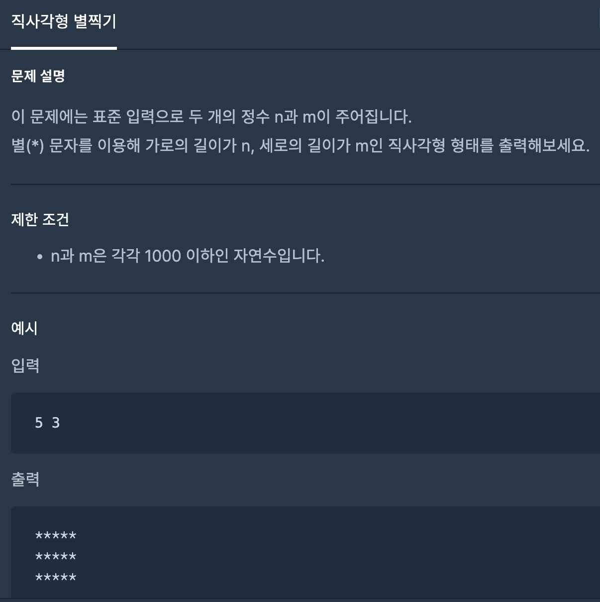

# Q


for문을 사용해서 가로길이만큼 * 만들고 줄바꿈 후 열만큼 반복해준다. 

```javascript
process.stdin.setEncoding('utf8');
process.stdin.on('data', data => {
    const n = data.split(" ");
    const a = Number(n[0]), b = Number(n[1]);
    
    for (let i=0;i<b;i++){
        let answer = ""
        for (let j=0;j<a;j++){
            answer += "*"
        }
        console.log(answer)
    }
    
});
```


