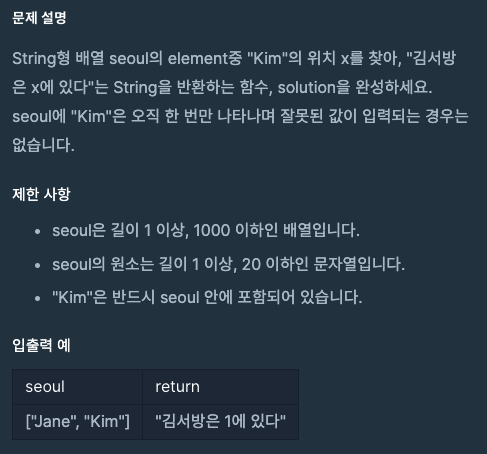

# Q



배열 안에 해당 요소가 있는지를 찾는 includes()를 떠올렸다.
그런데 includes는 ture or false를 반환.. index 는 어떻게 찾지?
검색해보니 indexof 발견


## indexOf
정확하게 일치하는 첫번째요소의 index를 반환함;
찾는 값 없으면 -1 반환.

searchElement 찾으려는 값
fromIndex 검색을 시작할 index defult는 0

arr.indevOf(“Kim”)

index가 0부터 시작하는 것을 잊고 index > 0으로 했다.

```javascript
const seoul = ["Kim", "Lee"];

function solution(seoul) {
    let answer = '';
    
    const idx = seoul.indexOf("Kim");
    
    if (idx !== -1){
        answer = `김서방은 ${idx}에 있다`;
    } else {
        answer = "김서방은 없다";
    }
    
    return answer;
}
```


